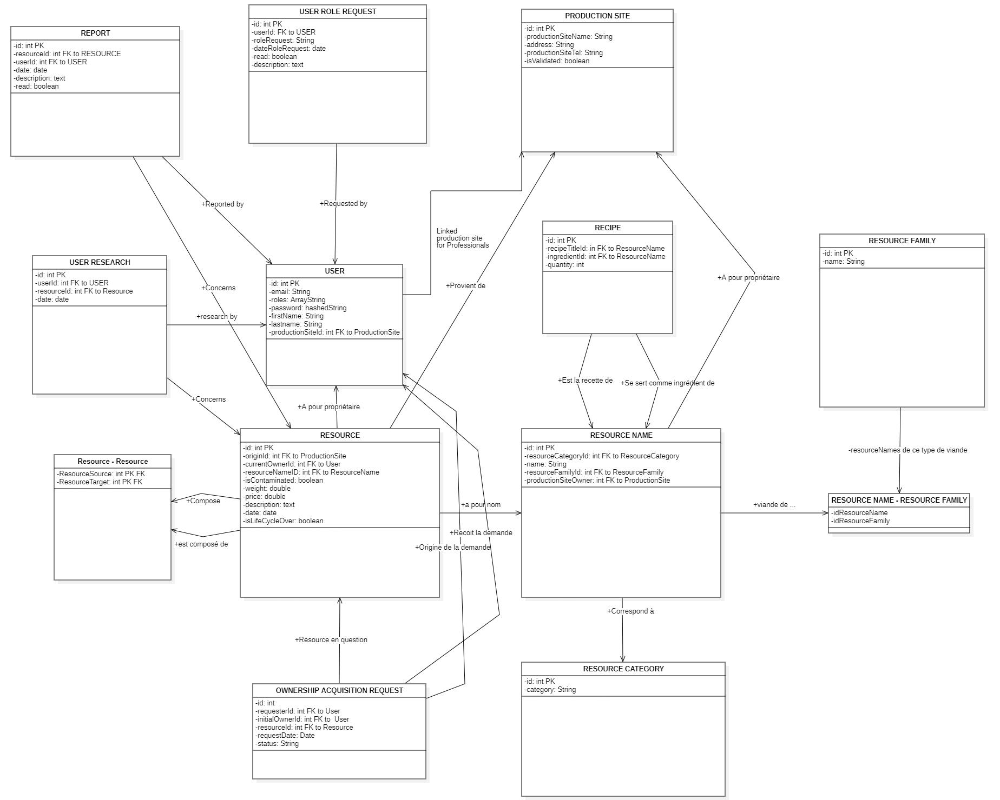

# BC24 : Traçabilité alimentaire en Symfony

## Présentation

Ce projet est l'interface utilisateur de l'application de traçabilité alimentaire spécialisée dans la viande
réalisée avec plusieurs groupes
d'étudiants de différents niveaux de la MIAGE de Paris 1.
Il est composé de deux parties : Une partie utilisateur,
permettant de consulter les informations et la traçabilité des produits, et une partie métier,
permettant tout au long de la chaîne de production de renseigner les informations nécessaires à la traçabilité, tout en
facilitant la gestion pour les différents acteurs de la chaîne.

## Installation

1. Cloner le projet et se placer à la racine du projet (gui/symfony-docker).
2. Installer les dépendances avec `composer update`
3. La BDD se trouve dans le dossier 'var' ; c'est un fichier SQLite nommé "BC24DB.db".
   Pour faire apparaître les différentes tables, il faut exécuter la commande `php bin/console doctrine:migrations:migrate`
4. Pour peupler la BDD, exécuter la commande `php bin/console doctrine:fixtures:load --group=app`
5. Les pages d'erreur 404 et 403 ayant été personnalisées, passer en mode production (sinon Symfony override les pages d'erreur)
   dans le .env
6. Les fichiers docker et le dossier frankenphp sont à usage futur, se servir du serveur de Symfony pour le moment : `symfony serve -d`

## OR run with docker anywhere

1. change the last line in bundles.php
   Twig\Extra\TwigExtraBundle\TwigExtraBundle::class => ['all' => false],

2. go into the root directory

   ```
   cd gui/symfony-docker
   ```

3. run the docker compose command

   ```
	docker-compose -f compose.yaml up --build -d
   ```

- dont use `-d` if you want to have docker output
- first time will take a minute or two
- will finally launch the application (make sure you check out all the host addresses)
  there are https://localhost:443 (https) and http://localhost:80 (http)
  Both should work but lets just stay with the later (80) one for now.

You will already be able to see the web app but no login is possible, since the DB migration was not yet done

4. enter the docker container comand line interface
   ```
   docker exec -ti symfony-docker-php-1 sh
   ```
5. in the docker container execute the DB shema creation and migration commands (answer all the questions with y)
   ```
   php bin/console doctrine:migrations:migrate
   php bin/console doctrine:fixtures:load --group=app
   ```

If you go back to the web app you will be able to log in now.

## Utilisation

### À savoir :

Pour visionner la BDD, nous recommandons d'utiliser SQLiteStudio et d'ouvrir le fichier .db avec ce logiciel.
Voir la fin de ce document pour un schéma de la BDD.

La fixture a créé plusieurs utilisateurs : Voici comment se connecter à leurs comptes :

Les différents rôles sont les suivants :
admin ; eleveur ; transporteur ; equarrisseur ; usine ; distributeur

Pour chacun de ses rôles, l'email est [nom du role]@gmail.com et le mot de passe est [nom du role].
Exemple :

#### Email : eleveur@gmail.com

#### MDP : eleveur

Il y a également 100 comptes clients, user0@gmail.com → user99@gmail.com avec le mot de passe "user".

### Fonctionnalités :

Pour tous les rôles :

- Espace client (Connexion, Déconnexion, Modification d'informations personnelles, Suppression de compte)
- Recherche de produit et suivi de la traçabilité
- Historique de recherche
- Affichage des produits récemment considérés dangereux pour la santé
- Signalement de produit

Pour les admin :

- Gestion des données en base de données : création de ressource, modification, suppression ; gestion des comptes, des rôles etc.

Pour tous les rôles métiers :

- Demande d'acquisition de ressource et liste des demandes avec leur statut
- Gestion des transactions (demandes d'acquisitions entrantes) : acceptation, refus (Sauf distributeur)
- Liste(s) des ressources dont ils sont responsables et informations sur ces ressources

Pour les éleveurs :

- Signalement de naissance

Pour les équarrisseurs :

- Enregistrement de la mort d'un animal (création d'une ressource de catégorie Carcasse)
- Enregistrement de la transformation d'une carcasse en demi-carcasse

Pour les usines :

- Découpe en morceaux d'une demi-carcasse (création de ressources de catégorie Morceau)
- Création de recette dont l'usine est propriétaire (association entre un nom de recette de catégorie PRODUIT avec des morceaux)
- Application de recette (création de ressources de catégorie PRODUIT, en suivant une recette prédéfinie)

Pour les distributeurs :

- Vente de ressources (sortie de la chaîne de production)

## Gestion du projet

Le projet a été géré sur un Notion, regroupant tous les différents groupes de travail.
Il est possible de le consulter [ici](https://www.notion.so/invite/871c052a59e13d1fd9d87985533f88fe1d821b95).

Vous retrouverez un agenda avec les tâches à réaliser, les tâches en cours, les tâches terminées, semaine par semaine,
ainsi que les réunions, les documents importants, etc.

## Schéma de la BDD

### Explications :

Les normes de représentations classiques de BDD ne sont pas respectées ici, le but étant seulement de donner une idée de comment fonctionne le modèle de données depuis l'extérieur.

La plupart des tables ne nécessitent pas d'explication, mais voici quelques précisions sur les tables et relations les plus complexes :

- RESOURCE_RESOURCE permet de représenter des liens de constitutions entre différentes ressources, avec une relation n-n. C'est cette table qui assure la traçabilité entre les différentes ressources.
  Par exemple, un produit fini peut être la composition de plusieurs morceaux de viande différents (n-1), et à l'inverse, une carcasse est toujours à l'origine de deux demi-carcasses (1-n).
- OWNERSHIP_ACQUISITION_REQUEST lie deux Users et une ressource et représente une demande d'acquisition de ressource.
- RECIPE est l'équivalent d'une table de relation n-n entre RESOURCE NAME et RESOURCE NAME, mais créée à la main avec Doctrine pour permettre d'ajouter un nombre d'ingrédients directement dans la colonne.
  Ce serait sous forme d'IDs dans la table, mais les enregistrements de cette table ressemblent à :

[NOM DU PRODUIT (de la recette) | INGREDIENT | QUANTITE]

[Kebab | Côte de Boeuf | 1]

[Kebab | Poitrine d'agneau | 3 ]

[Steak AOP Poitou-Charentes | Côte de Boeuf | 1]

.
.
.

### Important : Le fonctionnement des Ressources

Une RESOURCE est une ressource qui existe (ou a existé) physiquement, un RESOURCE NAME est un nom possédé par une RESSOURCE.
Par exemple, un steak en particulier est une RESOURCE, et "Steak" est son RESOURCE NAME.

Une RESOURCE a un unique RESOURCE NAME, mais un RESOURCE NAME peut être partagé par plusieurs ressources.

RESOURCE NAME est donc l'appellation d'une RESOURCE: "Boeuf", "Carcasse de boeuf", "Demi-Carcasse de boeuf", "Côte de boeuf", "Steak de boeuf" sont des exemples de RESOURCE NAME.

À chaque RESOURCE NAME est donc liée une et une seule RESOURCE CATEGORY, qui permet de définir le type de ressource, parmi les choix suivants : "ANIMAL", "CARCASSE", "DEMI-CARCASSE", "MORCEAU", "PRODUIT".

De plus, à chaque RESOURCE NAME est associé une ou plusieurs RESOURCE FAMILY qui représente la famille de viande à laquelle appartient la ressource.
Par exemple, "Boeuf", "Carcasse de boeuf", etc jusqu'à "Steak de boeuf" appartiennent à la famille "Boeuf".
Mais par exemple un "Kebab" peut être de plusieurs familles différentes, comme "Boeuf" et "Agneau" par exemple.

Ainsi, seuls les RESOURCE NAMEs de catégorie PRODUIT peuvent être associés à plusieurs RESOURCE FAMILY.

Prenons deux exemples :

- Une vache réelle, dans un champ, est une RESSOURCE. Son RESOURCE NAME est "Vache", RESOURCE NAME fortement lié à la CATEGORY "ANIMAL" et à la FAMILY "Vache".
  Ainsi, on peut déduire de cette instance de vache que si elle venait à être équarrie, on obtiendrait une "Carcasse de vache", qui est le RESOURCE NAME qui combine la CATEGORY "CARCASSE" et la FAMILY "Vache".

- Un Kebab, dans un restaurant, est une RESSOURCE. Son RESOURCE NAME est "Kebab", RESOURCE NAME fortement lié à la CATEGORY "PRODUIT" et à une ou plusieurs FAMILY, selon la recette de l'usine qui l'a produit.

###### En effet, en créant une recette, l'usine **_crée_** un RESOURCE NAME dont elle a la propriété, forcément de Catégorie PRODUIT, et c'est elle qui choisit les FAMILYs de viande dont le produit est composé.

En résumé, un RESOURCE NAME est un moule qui donne toutes les informations, tandis qu'une RESOURCE est une instance.

### Schéma :


